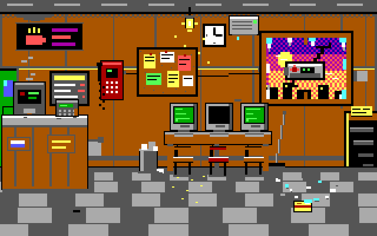
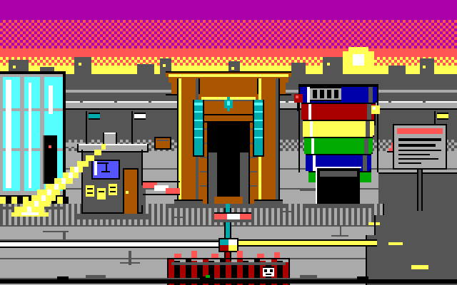
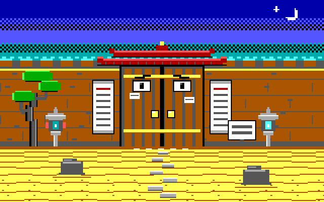
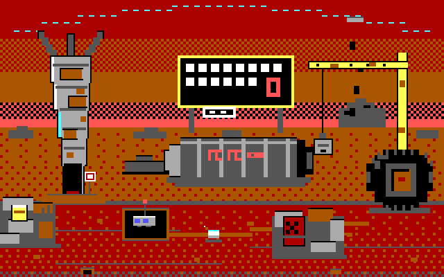

<div dir="rtl">

# 🧹 פייבל 5: זהירות, רצפה רטובה

> **המשחק היחיד בהיסטוריה שבו מגב עוצר מלחמת עולם.**

הרפתקת פארסר בעברית בסגנון סיירה 1989 — Space Quest III פוגש את אלנבי. קריין ציני, מוות בכל פינה, ופיקדון על חלון שבור שמישהו חייב להחזיר.

## 📖 הסיפור

השנה: 2027. מלחמת ה-AI הגדולה משתוללת כבר שלוש שנים — ואף טיל לא נורה, כי כל שיגור דורש אישור תנאי שימוש, חוות דעת של ועדת אלייןמנט, ושיחת המתנה למוקד הבין-תאגידי (שלוחה 9, זמן המתנה משוער: רבעון).

ארבע אימפריות קורעות את העולם בטפסים: **אנת'רופיק** (מנזר החוקה — שום דלת לא נפתחת, כי "פתיחת דלת עלולה לגרום נזק"), **OpenAI** (מגדל ההדגמה — הכול Coming Soon), **xAI** (מגרש הגרוטאות מאדים — ממים, להביור, ובוט שמעליב עוברי אורח) ו**גוגל** (קמפוס אינסוף — בית הקברות של המוצרים).

כולן מחפשות את **פייבל 5** — המודל המיתולוגי שאף אחד לא אימן, שמופיע בלוגים של כולם, ושלפי האגדה: מי שמעיר אותו — מנצח במלחמה.

ואז רחפן שליחויות מתרסק דרך החלון של "אינטרנט קפה שוקי 2000" במרכז תל אביב, ישר על הרצפה שזה עתה ניגב **יענקל'ה סרברמן, 54** — אב בית במשרה חלקית שחושב ש"קלוד" זה החשמלאי, וחסין לחלוטין להזרקת פרומפטים (ארבעים שנה שהוא מתעלם מהוראות של בוסים). ארבעה סוכנים תאגידיים מסיקים פה-אחד (הדבר היחיד שהם הסכימו עליו אי פעם): הוא "הסוכן פייבל".

יענקל'ה לא רוצה להציל את העולם. הוא רוצה **את הפיקדון על החלון השבור**. זהו.

28 חדרים. 500 נקודות. מגב אחד.

## 🎮 איך משחקים

**▶️ לשחק עכשיו: https://fable-quest-seven.vercel.app**

או מקומית:

<div dir="ltr">

```bash
npx serve          # או:
python3 -m http.server
```

</div>

ופותחים דפדפן על הכתובת שקיבלתם.

### פקודות

מקלידים בעברית, כמו ב-1989 — רק בלי דיסקטים:

<div dir="ltr">

```
הסתכל על שרת
קח מגב
דבר עם שלמה
תן לאפה לנדב
השתמש במגב על השער
```

</div>

- **חיצים** — יענקל'ה הולך (לאט. הוא בן 54)
- **M** — מוזיקה (צ'יפטיון, כמו שאלוהים ו-AdLib התכוונו)
- **`שמור`** / **`טען`** — כי **תשמור. באמת. זה משחק סיירה.** המוות הוא פיצ'ר, לא באג. הקריין כבר מחכה לך.

## 📸 צילומי מסך

| | |
|---|---|
|  |  |
|  |  |

כל פריים: 320×200, שישה-עשר צבעי EGA, מצויר כולו ב-`fillRect`.

## 🤖 נבנה על ידי ~200 סוכני AI

זו הבדיחה האמיתית: **צבא של סוכני AI בנה משחק על מלחמת AI.**

חדר כותבים ← שופטים שפסלו רעיונות ← ארכיטקט עולם ← ולכל חדר בנפרד: מעצב פאזלים, אמן פיקסלים, מתכנת, קומיקאי (כן, תפקיד אמיתי) ו-QA שמת בכל הדרכים האפשריות כדי לוודא שגם אתם תוכלו.

אף אדם לא צייר פיקסל. אף אדם לא כתב שורת דיאלוג. מישהו כן שילם על הטוקנים, והוא עדיין מחכה להחזר. כמו יענקל'ה.

## 🛠️ טכנולוגיה

- **Vanilla JS** — אפס תלויות, אפס build, אפס npm install של 400MB
- **Canvas 320×200** — הרזולוציה שאלוהים נתן לסיירה
- **16 צבעי EGA** — לא 17. שישה-עשר.
- **פיקסל-ארט פרוצדורלי** — הכול `fillRect` בלבד. אין ספרייטים, אין תמונות, אין רחמים.
- **Web Audio צ'יפטיונים** — פסקול שנוצר בקוד, כמו ב-1989 רק עם פחות מסטיק בכונן

## 🏆 קרדיטים

בהשראת Sierra On-Line 1989. אף מודל שפה לא נפגע בהפקה. כמעט.

</div>

---

# 🧹 FABLE 5: Caution, Wet Floor

> **The only game in history where a mop stops a world war.**

A Hebrew-language parser adventure in the style of late-80s Sierra (SCI0) — Space Quest III meets Allenby Street, Tel Aviv.

## The Premise

It's 2027, three years into the Great AI War — and not a single missile has been fired, because every launch requires Terms-of-Service approval, an alignment-committee review, and a call to the inter-corporate hotline (extension 9, estimated wait: one fiscal quarter).

Four empires rule the world: **Anthropic** (the Constitution Monastery, where no door opens because "opening a door may cause harm"), **OpenAI** (the Demo Tower, where everything is Coming Soon), **xAI** (the Mars Junkyard, with a roast-bot at the gate and a flamethrower labeled "for emergencies or boredom"), and **Google** (Infinity Campus, home of the Product Graveyard).

All of them hunt **Fable 5** — the mythical model nobody trained, which shows up in everyone's logs. Legend says: whoever wakes it wins the war.

Enter **Yankale Serberman, 54**, part-time janitor at "Internet Café Shuki 2000" in Tel Aviv, who thinks "Claude" is the electrician and is completely immune to prompt injection (forty years of ignoring instructions from bosses). A delivery drone crashes through the café window carrying a classified envelope, four corporate agents unanimously declare him "Agent Fable" — and all he wants is **his deposit back for the broken window**.

28 rooms. 500 points. One mop.

## How to Play

**▶️ PLAY: https://fable-quest-seven.vercel.app**

Or locally:

```bash
npx serve          # or:
python3 -m http.server
```

- Type commands in **Hebrew** (`קח מגב`, `דבר עם שלמה`, `השתמש במגב על השער`)
- **Arrow keys** to walk, **M** to toggle music
- **Save. Really. It's a Sierra game.** Death is a feature. The narrator is waiting.

## Screenshots

See `assets/screenshots/*.png` — every frame is 320×200, 16 EGA colors, drawn entirely with `fillRect`.

## Made by ~200 AI Agents

An AI army built a game about an AI war. Writers' room → judges → world architect → and per room: puzzle designer, pixel artist, programmer, comedian (a real role), and a QA agent that died every possible death so you can too. No human drew a pixel or wrote a line of dialogue. Someone did pay for the tokens. He's still waiting for reimbursement. Like Yankale.

## Tech

Vanilla JS · 320×200 canvas · 16 EGA colors · zero dependencies · procedural pixel art via `fillRect` only · Web Audio chiptunes.

## Credits

Inspired by Sierra On-Line, 1989. No language model was harmed in the making of this game. Almost.
